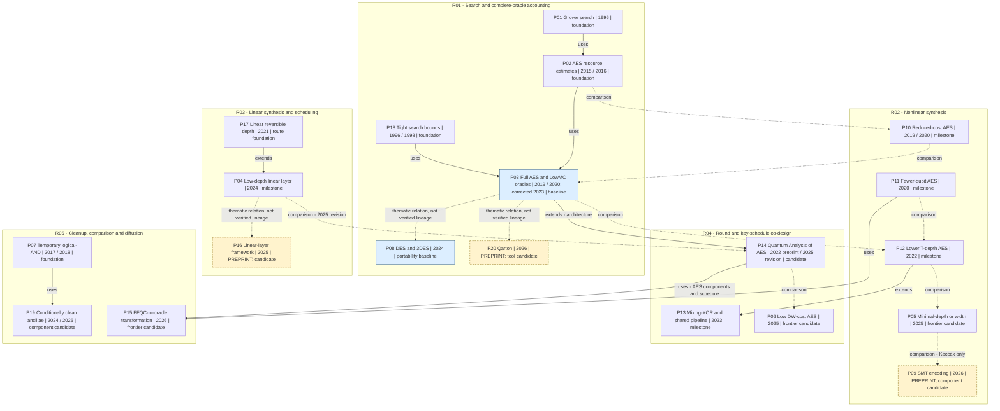

# Q1 Grover oracle optimization: an evidence-linked research landscape

**Search and cutoff:** 2026-09-27. **Recent window:** 2024-09-27–2026-09-27. **Coverage:** preliminary; 20 core papers, five overlapping routes.

## 1. Core evolution graph

Nodes retain the project's G01–G09 aliases as P01–P09; IDs do not encode chronology. Placement uses one primary route per node; the JSON records cross-membership. Labels give initial/publication years where they differ, plus important revisions.

**Legend:** solid `uses`/`extends` edges have documentary evidence; dashed `comparison` edges mean the later paper compares with the earlier one, not that superiority is independently established. Dashed **“thematic relation, not verified lineage”** edges are analyst links. Yellow dashed-outline nodes are preprints; blue nodes are reproduction/portability baselines. “Candidate” indicates an unresolved assessment, not a verified optimum. The P04→P14 comparison belongs to P14's **2025 revision**, not its initial 2022 release.



## 2. Route comparison

### Accounting contract

For fixed classical pairs, use the predicate and clean-workspace contract from the [research plan](../../docs/research-plan.md):

```text
f(K) = AND_i [E_K(P_i) = C_i]
O_f |K>|0_workspace> = (-1)^f(K) |K>|0_workspace>
Grover iteration = phase oracle followed by key-register diffusion
```

Report four separate objects: **encryption; complete phase oracle; complete iteration; successful key-recovery attack**. A fixed-key encryption oracle is not a coherent candidate-key implementation.

| Contract item | Required normalization |
|---|---|
| Search problem | Key/block size, number of pairs, marked-key count assumptions, target success, verification and retries |
| Circuit interface | In-place/out-of-place, preserved registers, clean/dirty/conditionally clean ancillas, all required final states |
| Gate model | NCT and Clifford+T separately; specify decomposition, measurements, feed-forward and topology |
| Resources | Peak live width, full scheduled depth, T-depth, family counts and measurements from the same circuit/schedule |
| Products | Label full-depth×width, T-depth×width and author-defined Toffoli-depth×width separately |
| Parallelism | Number of processors, partition policy, aggregate work and per-processor depth cap |

For a strictly unitary compute–mark–uncompute construction, gate counts can be written as `2 C_compute + C_mark`; the diffuser is additional. Measurement-assisted cleanup requires its own count and schedule. Width is peak liveness, not the sum of independently optimized component widths; full depth cannot be inferred from T-depth alone.

For known `M`, ideal Grover success is `sin²((2j+1) asin(sqrt(M/2^k)))` after `j` iterations (P01, P18). The familiar square-root count has assumptions. Under the ideal-cipher/independent-pair approximation, expected false matches are approximately `(2^k−1) 2^(−nr)`. Thus AES-128 with one pair has roughly one additional matching key in expectation; two pairs reduce that expectation to roughly `2^−128`. This guides the baseline's pair count but does not prove uniqueness for a concrete transcript. Finding a matching key and recovering the original key are different success events.

### Comparison table

| Route and question | Foundations and turning points | Methods and strengths | Conditions and limitations | Recent work and conditional assessment | Read/reproduce first |
|---|---|---|---|---|---|
| **R01 Search/accounting:** how does a circuit become a successful, reproducibly costed search? | P01/P18 search; P02 early explicit AES costing; P03 executable predicates and corrected estimates | Transcript matching, success analysis, depth-limited parallel search; connects local circuits to attack cost | Match pair count, marked keys, success and processor assumptions; include diffusion and final verification | P14 revisits architectures/estimator issues; P20 offers large-circuit tooling. Complete-iteration leader **undetermined** | Corrected P03; P08 later for cross-cipher portability |
| **R02 Nonlinear synthesis:** which S-box is best after integration? | P02/P10 early cost reductions; P11 width; P12 T-depth/width; P13 shared pipeline | Algebraic synthesis, in-place designs, small exact synthesis; exploits nonlinear bottlenecks | Match input/output contract, ancillas and gate model; local optimality does not imply an optimal attack | P05 low-T-depth/minimal-width variants; P06 in-place S-boxes; P09 bounded NCT synthesis. **Candidates in different domains** | P12's tradeoff spectrum, then P05/P06 |
| **R03 Linear synthesis/scheduling:** how much full depth remains in linear layers? | P17 depth-oriented greedy/divide-and-conquer methods; P04 applies improved greedy synthesis to AES; P13 integrates linear/nonlinear scheduling | CNOT synthesis and gate reordering; can improve full depth even when T-count is unchanged | Match binary map, topology, ancillas, permutation treatment and scheduler; reported depth can depend on software order | P04 claims ancilla-free MixColumns depth 10; P16 explores reordering; P09 supplies small exact-synthesis examples. **No verified minimum** | P17, then P04 with a fixed scheduler |
| **R04 Round/key co-design:** which schedule best trades live workspace for depth? | P02/P10; P03; P11 zig-zag; P12 in-place rounds; P13 shared forward/adjoint pipeline | Round overlap, key-schedule overlap, lifetime reuse and compressed pipelines; addresses whole-cipher dependencies | Candidate keys must remain coherent; fixed-key preprocessing is not interchangeable; mark/cleanup boundary affects reuse | P04/P14 architectures; P06 narrow candidate; P15 redistribution using P14 components. **Pareto candidates**, not one winner | P03 baseline, P13 architectural prior art, then P14/P06 |
| **R05 Cleanup/comparison/diffusion:** how can workspace be restored more cheaply? | P07 temporary logical-AND; P03 complete predicate | Measurement-assisted erasure, global vs local cleanup, clean/dirty/conditionally clean multi-control constructions | Verify phase behavior, borrowed-state restoration, feed-forward and measurement latency; distinguish equality from arithmetic comparison | P19 few-ancilla multi-control methods; P06 final-round cleanup omission; P15 unitary oracle transformation. **Integration leader undetermined** | P07 and P03 before P19/P15 substitutions |

“Foundation” denotes an anchor for this scoped route, not necessarily the first paper in the broader topic. In particular, P07 credits earlier AND/decomposition work, and P17 is not the origin of all linear reversible synthesis. Generic reversible-computation and pebbling history remains an expansion area.

## 3. Core paper cards

Dates below distinguish first repository release from formal publication; a repository deposit need not be the earliest circulation. Exact unknown release dates remain unknown. Original titles and full author lists are retained here and in the JSON.

### Foundations and the reproducible baseline

**P01 / G01 — A fast quantum mechanical algorithm for database search.** Lov K. Grover. STOC **1996**; arXiv v1 1996-05-29, checked v3 1996-11-19; earliest exact public day not established. **Read: selected full text (2026-09-28).** Inspected STOC §§1–4, pp. 212–215, and arXiv v3 §§1–3 plus §4 p. 4; detailed convergence proofs not audited. The search foundation supplies the query-level speedup; it does not specify AES predicate cost. The v3 §3 closing paragraph explicitly requires phase marking to leave no state trace, enabling interference. [Primary record and DOI](https://arxiv.org/abs/quant-ph/9605043); [version-specific sources and reading progress](../papers/P01/reading.md).

**P18 — Tight bounds on quantum searching.** Michel Boyer, Gilles Brassard, Peter Høyer, Alain Tapp. Preprint **1996-05-23**; *Fortschritte der Physik* **1998**. **Read: abstract.** Essential for exact success probability, multiple solutions and unknown solution count. Its arXiv upload precedes P01's upload but discusses Grover's already circulating algorithm; upload order is not an invention-priority claim. [Primary record](https://arxiv.org/abs/quant-ph/9605034); evidence: Abstract and journal reference.

**P02 / G02 — Applying Grover's algorithm to AES: quantum resource estimates.** Markus Grassl, Brandon Langenberg, Martin Roetteler, Rainer Steinwandt. Preprint **2015-12-15**; PQCrypto **2016**. **Read: abstract**, with historical attribution cross-checked in P03 and P15. Early explicit Clifford+T estimates for all three AES key sizes establish the cipher-to-search resource question. [Primary record](https://arxiv.org/abs/1512.04965); evidence: Abstract; P15 Appendix B's attribution of the initial zig-zag architecture.

**P03 / G03 — Implementing Grover oracles for quantum key search on AES and LowMC.** Samuel Jaques, Michael Naehrig, Martin Roetteler, Fernando Virdia. Initial ePrint **2019-10-03**; EUROCRYPT **2020**; **corrected 2023-06-07**. **Read: selected full text**, particularly §3.3, §6 and Table 9. Milestone and recommended baseline: executable predicates, pair-dependent resources and explicit estimator corrections. AES estimates were corrected; LowMC was not revised. §6.2 omits diffusion in attack estimates. [Paper](https://eprint.iacr.org/2019/1146), [artifact](https://github.com/microsoft/grover-blocks). Artifact metadata inspected; no reproduction.

### Nonlinear synthesis and architectural turning points

**P10 — Reducing the Cost of Implementing AES as a Quantum Circuit.** Brandon Langenberg, Hai Pham, Rainer Steinwandt. ePrint **2019-07-23**; later IEEE TQE **2020** publication uses the expanded title “Reducing the Cost of Implementing the Advanced Encryption Standard as a Quantum Circuit.” **Read: abstract.** Early joint S-box/key-expansion reduction; P03 §4.1 explicitly ports and compares its S-box. [Preprint](https://eprint.iacr.org/2019/854); publication identity corroborated by [P14's bibliography](https://cic.iacr.org/p/2/1/25). Bibliography here consistently cites the preprint identity.

**P11 — Quantum Circuit Implementations of AES with Fewer Qubits.** Jian Zou, Zihao Wei, Siwei Sun, Ximeng Liu, Wenling Wu. ASIACRYPT **2020**; exact first release unknown. **Read: abstract.** Width-focused turning point using inverse-S-box and key-schedule changes; P15 Appendix B explicitly reuses its improved zig-zag architecture. [CryptoDB record](https://www.iacr.org/cryptodb/data/paper.php?pubkey=30716); evidence: Abstract and P15 Appendix B. Encryption-side widths are not complete-oracle widths.

**P12 — Synthesizing Quantum Circuits of AES with Lower T-depth and Less Qubits.** Zhenyu Huang, Siwei Sun. First ePrint **2022-05-23**, revised **2022-09-14**; ASIACRYPT **2022**. **Read: abstract.** In-place round construction and a spectrum of width/T-depth choices; a useful baseline for component tradeoffs and an explicit starting point for P13. [Primary record](https://eprint.iacr.org/2022/620); evidence: Abstract. Its comparisons with EUROCRYPT 2020 precede P03's 2023 correction. The precise domain of its minimality claim remains to audit.

**P13 — Improved Quantum Circuits for AES: Reducing the Depth and the Number of Qubits.** Qun Liu, Bart Preneel, Zheng Zhao, Meiqin Wang. ePrint approved **2023-09-24**; ASIACRYPT **2023**. **Read: abstract.** Mixing-XOR and a share technique combine an S-box and its adjoint in a pipeline, explicitly extending P12. This is important prior art for joint scheduling and ancilla reuse. [Primary record](https://eprint.iacr.org/2023/1417); evidence: Abstract; [publication record](https://www.iacr.org/cryptodb/data/paper.php?pubkey=33484).

**P05 / G05 — Constructing Quantum Implementations with the Minimal T-depth or Minimal Width and Their Applications.** Zhenyu Huang, Fuxin Zhang, Dongdai Lin. First ePrint **2025-02-12**, major revision **2025-03-04**; EUROCRYPT **2025**. **Read: abstract.** Recent nonlinear candidate: compact T-depth-3 AES S-boxes and separate narrow constructions. These are different objectives/variants; neither establishes a complete-oracle optimum. [Primary record](https://eprint.iacr.org/2025/212); evidence: Abstract and publication label. Theorem domains and cleanup contracts need full-text verification.

**P06 / G06 — Quantum Circuit Synthesis for AES with Low DW-cost.** Haoyu Liao, Qingbin Luo. First ePrint **2025-08-19**, revised **2025-11-27**; ASIACRYPT **2025**. **Read: selected full text**, Table 4, footnote 3 and Appendices F–H. Combines in-place S-boxes, specialized nonlinear components and key scheduling. A strong low-width candidate, but its reported oracle omits comparison and uses measurement-assisted decomposition. [Paper](https://eprint.iacr.org/2025/1494), [S-box artifact](https://github.com/lhyGovinda/AES-with-In-Place-S-Boxes). Artifact README inspected, not run; it describes two S-box implementations rather than a reproduced full search.

**P09 / G09 — Novel SMT Encoding for Quantum Circuit Optimization.** Youbo Guo, Fengrong Zhang, Lei Liao, Yongzhuang Wei, Baocang Wang, Xiaogang Zhou. Approved **2026-08-28**; **preprint**. **Read: abstract.** Recent exact-G/at-most-G encoding candidate with bounded no-ancilla NCT claims for a Keccak S-box and a small linear-layer example. The comparison to P05 is not an AES improvement claim. [Primary record](https://eprint.iacr.org/2026/1815); evidence: Abstract/History. Solver witnesses, lower bounds and acceptance status remain unverified.

### Linear layers and integrated architectures

**P17 — Reducing the Depth of Linear Reversible Quantum Circuits.** Timothée Goubault de Brugière, Marc Baboulin, Benoît Valiron, Simon Martiel, Cyril Allouche. IEEE TQE **2021**; later arXiv deposit **2022-01-17**; earliest exact release unknown. **Read: abstract.** Route foundation for depth-oriented divide-and-conquer and greedy linear synthesis, explicitly identified as a starting point by P04. [Primary record](https://arxiv.org/abs/2201.06380); evidence: Abstract and journal reference. The 2022 upload is not a distinct follow-up paper.

**P04 / G04 — Quantum Circuits of AES with a Low-depth Linear Layer and a New Structure.** Haotian Shi, Xiutao Feng. First ePrint **2024-03-01**, revised **2024-10-06**; ASIACRYPT **2024**. **Read: abstract.** Extends depth-oriented greedy synthesis and introduces a compressed pipeline. Authors report ancilla-free MixColumns depth 10. [Primary record](https://eprint.iacr.org/2024/381); evidence: Abstract/History. Its separate encryption-oracle result for Simon must not be substituted for this Q1 candidate-key predicate. Conference year 2024 is retained despite a proceedings copyright-year difference.

**P14 — Quantum Analysis of AES.** Kyungbae Jang, Anubhab Baksi, Hyunji Kim, Gyeongju Song, Hwajeong Seo, Anupam Chattopadhyay. Initial ePrint **2022-05-31**; checked revision **2025-06-22**; CIC **2025**, volume 2, issue 1. **Read: abstract and publication metadata/references.** Essential architectural competitor: the authors describe 78 implementations, estimator corrections and depth-limited search analysis. [Publication](https://cic.iacr.org/p/2/1/25), [ePrint](https://eprint.iacr.org/2022/683), DOI `10.62056/ay11zo-3y`. Comparisons against 2024 work belong to the later revision; June 22 is the ePrint revision date, not an asserted publication day. Full numerical reconciliation with corrected P03 is pending.

**P16 — A Framework for Efficient Quantum Implementations of Linear Layers.** Kyungbae Jang, Anubhab Baksi, Hwajeong Seo. Approved **2025-10-17**; **preprint**. **Read: abstract.** Recent linear-scheduling candidate: gate reordering affects reported depth for AES MixColumn, S-box internals and finite-field operations. [Primary record](https://eprint.iacr.org/2025/1915); evidence: Abstract/History. This motivates separating algebraic circuit quality from scheduler artifacts; no direct lineage from P04 or numerical superiority is established here.

### Cleanup and broader accounting

**P07 / G07 — Halving the cost of quantum addition.** Craig Gidney. First preprint **2017-09-19**; checked arXiv v3 **2018-06-13**; *Quantum* **2018**, article 74. **Read: full-text HTML**, especially Figures 3 and 5. Reusable four-T temporary logical-AND with zero-T measurement-assisted erasure; zero T does not mean zero measurement/Clifford/latency cost. The paper discusses Grover use, intermediate phase-sensitivity restrictions and ancilla growth, and credits earlier work. [Full text](https://arxiv.org/html/1709.06648v3); [DOI](https://doi.org/10.22331/q-2018-06-18-74).

**P19 — Rise of conditionally clean ancillae for efficient quantum circuit constructions.** Tanuj Khattar, Craig Gidney. First preprint **2024-07-25**, checked v2 **2025-05-20**; *Quantum* **2025**, article 1752, published May 21. **Read: selected full text**, §1–5.2/Table 1 plus comparator-heading check. Recent multi-control candidate relevant to equality/marking and diffusion. [Full text](https://arxiv.org/html/2407.17966v2); evidence: §3, §5.2 Figure 3. Borrowed states require restoration; the clean-ancilla construction explicitly uses P07 measurement-based cleanup. §6.3's arithmetic comparator is `LessThanConst`, not AES equality.

**P15 — Low-Depth Construction of Grover Oracles from Fully Functional Quantum Circuits.** Behzad Abdolmaleki, Jiaqi Gu. Full-version ePrint approved **2026-03-22**; IEEE QCNC **2026**, as labeled by the official ePrint record. **Read: selected full text**, §1.1, §3.2, §4 and Appendix B. Direct prior art for removing local cleanup and reintroducing depth-preserving cleanup within a computational-basis/unitary-reversal framework. [Paper](https://eprint.iacr.org/2026/568). Appendix B uses P11 and P14, but its AES width numbers explicitly omit comparison and marking. Schedule dependence, width tradeoffs and an arithmetic typo require care; see §4 below.

**P08 / G08 — A Quantum Circuit to Execute a Key-Recovery Attack Against the DES and 3DES Block Ciphers.** Simone Perriello, Alessandro Barenghi, Gerardo Pelosi. IEEE QCE **2024**, September 15–20; exact first public release unknown. **Read: metadata and artifact README.** Portability baseline, not an AES competitor: the author artifact describes S-box tests and attack-metric generation in NCT+H and Clifford+T. [Artifact](https://github.com/paper-codes/2024-QCE), [DOI](https://doi.org/10.1109/QCE60285.2024.00011). Its QRAM-free Grover and QRAM-using 3DES meet-in-the-middle settings must remain separate. No experiments run.

**P20 — Building Quantum Circuits with Qarton.** André Schrottenloher. Received **2026-09-23**, approved **2026-09-26**; **preprint**. **Read: abstract.** Newest verified core release, introducing hierarchical logical-circuit representation and resource estimation for large cryptanalytic computations. [Primary record](https://eprint.iacr.org/2026/2191); evidence: Abstract/History. Tool candidate only: no code inspected or AES resource result verified.

## 4. Newest work versus best-supported choices

### Newest verified core releases and recent revisions

| Date | Work | What is recent | Status / evidence |
|---|---|---|---|
| 2026-09-26 | P20 Qarton | New resource-estimation tool paper | Preprint; abstract |
| 2026-08-28 | P09 SMT encoding | New bounded-synthesis paper | Preprint; abstract |
| 2026-03-22 | P15 FFQC transformation | Full-version ePrint | QCNC label verified; selected full text |
| 2025-11-27 | P06 low DW-cost | Revised Clifford+T oracle/encryption appendices | ASIACRYPT 2025; selected full text |
| 2025-10-17 | P16 linear framework | New reordering paper | Preprint; abstract |
| 2025-06-22 | P14 Quantum Analysis of AES | Revised work first posted in 2022 | CIC 2025; abstract |

P04's 2024 revision/publication, P05's 2025 publication and P19's 2025 revision/publication also fall inside the recent window. “Newest” here means within the verified core set, not an exhaustive claim about every paper available at cutoff.

### Numerical evidence: three different accounting boundaries

These are **transcribed author results, not reproduced benchmarks**. The separate tables are intentional: their metrics and circuit boundaries do not support a cross-paper ranking.

**A. Reproduction target — P03, corrected Table 9, lower AES-128 `r=2`, IP row.** This row is in the block minimizing the paper's `G_D² G_W` objective; IP denotes in-place MixColumn. Comparison is included; the diffuser is additional.

| Full logical depth | Peak logical qubits | T-depth | T gates | CNOT | 1-qubit Clifford | Measurements |
|---:|---:|---:|---:|---:|---:|---:|
| 3,416 | 8,743 | 128 | 109,820 | 571,006 | 182,255 | 27,455 |

Source: [corrected P03](https://eprint.iacr.org/2019/1146.pdf), §3.3 and Table 9; §6.2 explains the omitted diffuser in attack costing. Do not use original 2020 counts as though they were corrected results.

**B. Low-width completion candidate — P06, Appendix G/Table 10, 2025-11-27 revision.** AES-128 encryption/uncomputation portion of the single-pair predicate, **excluding ciphertext comparison**, with measurement-assisted mappings and no diffuser.

| T-depth | Peak logical qubits | T-depth×width | T gates | CNOT | 1-qubit Clifford | Measurements |
|---:|---:|---:|---:|---:|---:|---:|
| 232 | 724 | 167,968 qubit-T-layers | 77,792 | 343,424 | 137,768 | 19,448 |

Source: [P06](https://eprint.iacr.org/2025/1494.pdf), Appendix G opening paragraph and Tables 7–10. This is the lowest T-depth×width point **within Table 10 as presented by the authors**; the preceding rows and their original contracts were not independently reconstructed. It cannot be ranked against A's `r=2`, comparison-inclusive, full-depth objective.

Three distinctions matter:

- **Table 4:** `120 × 544 = 65,280` uses the authors' “Toffoli depth” convention. Footnote **3** explicitly excludes layers replaceable by `QAND†`. It is neither full logical depth nor strictly unitary NCT depth, and it is an encryption-side figure.
- **Appendix G:** forward/reverse resource calculation exploits measurement-assisted QAND cleanup and omitted final-round local uncomputation. Measurements and classical dependencies must enter any full-depth estimator; mechanically doubling a unitary circuit count is insufficient.
- **Appendix H/Table 11:** fixed-key encryption permits classically precomputed key expansion. Its resources cannot replace coherent candidate-key scheduling in Q1 key search.

**C. Conditional shared-component width claim — P15 Appendix B, referring to P14.** These are forward target-function `F` resources, not a completed phase oracle.

| Variant | Logical qubits | Boundary and provenance |
|---|---:|---|
| P14 architecture as quoted by P15 | 7,280 | Baseline not independently checked in P14's original table |
| P15 modified ancilla redistribution | 7,104 | Same named AES components/key schedule; comparison and marking excluded |

Source: [P15](https://eprint.iacr.org/2026/568.pdf), Appendix B, Step 2 and final paragraphs. This supports an **author-reported, conditional component-width reduction**, not a complete-oracle record. Appendix B also contains `2 × 62 = 114`, an unresolved arithmetic typo, and depth-647 terminology that needs reconciliation with P14. Neither is silently corrected into a verified saving here. P15's unitary/global-reversal discussion should not be combined automatically with measurement-assisted P06/P19 costs.

### What can be recommended now?

- **Best first reproduction target:** P03's corrected AES implementation, because its predicate boundary, estimator fixes and artifact are explicit.
- **Low-width/low-T-depth-width AES candidate:** P06, after adding matched pair handling, comparison, cleanup and diffusion.
- **Low-depth and architecture-space competitor:** P14, pending full-text normalization against corrected P03.
- **Nonlinear frontier:** P05/P06, with distinct width/T-depth contracts; P09 for bounded small-component synthesis, not an AES record.
- **Linear frontier:** P04/P16, pending common scheduler and circuit verification.
- **Oracle-aware cleanup and multi-control frontier:** P15/P19, under their different unitary/measurement and ancilla assumptions.

No paper is designated a universal complete-iteration winner, and no independently checked theorem of global AES optimality is asserted.

### Competitors retained on the watchlist

| Candidate | Why it could change the assessment | Why not promoted to the core ranking |
|---|---|---|
| Chen, Cai, Gao, Lin, *Quantum circuit for implementing AES S-box with low costs*; [ePrint 2025/454](https://eprint.iacr.org/2025/454), [arXiv 2503.06097](https://arxiv.org/abs/2503.06097), QIP 2026 [DOI](https://doi.org/10.1007/s11128-026-05083-7) | AES S-box and reported T-depth×width 102,800 could affect the low-cost frontier | v2 dated 2025-08-01; preprint/published abstract wording differs on linear vs nonlinear key-schedule optimization. Metric boundary, pair count and comparison/cleanup not verified; no comparison to P06's 167,968 is justified |
| [ePrint 2025/1664](https://eprint.iacr.org/2025/1664), large-S-box MILP candidate | Optimization of nonlinear components | Retrieved description uses U+CX-transpiled depth; not normalized to Clifford+T/full-oracle accounting |
| [ePrint 2026/1446](https://eprint.iacr.org/2026/1446), LLM-assisted circuit optimization, revised 2026-08-06 | Recent implementation/search methodology | Preprint, chiefly lightweight-cipher evidence; AES complete-oracle claim and independent verification not established |
| ADOQ and newer multi-controlled-gate decompositions | Could affect comparison/diffusion or implementation automation | Candidate identities, versions and compatible cost models require a dedicated expansion round |
